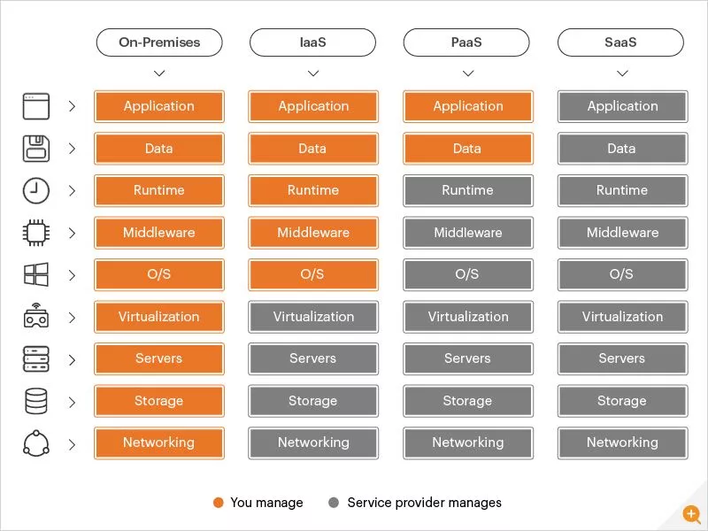

# SaaS (Software as a Service)

A method of distributing applications over the Internet as a service is known as software as a service (or SaaS). You can avoid complicated software and hardware maintenance by just accessing software over the Internet rather than installing and maintaining it.

SaaS applications are also referred to as hosted software, web-based software, and on-demand software. Whatever name they go by, SaaS applications run on the servers of a SaaS provider. The security, availability, and performance of access to the application are all managed by the supplier.

SaaS, along with platform as a service and infrastructure as a service (IaaS), is one of the three basic types of cloud computing (PaaS). SaaS apps are used by a variety of IT specialists, business users, and private consumers. Products range from high-tech IT equipment to personal entertainment options like Netflix. SaaS products are commonly promoted to both B2B and B2C users, unlike IaaS and PaaS.

# Saas Delivery

SaaS eliminates the need for IT professionals to download and install software on each computer thanks to its web delivery methodology. With SaaS, vendors take care of all potential technical problems, including data, middleware, servers, and storage, which streamlines corporate maintenance and support.

# Benefits of SaaS

By drastically lowering the time and money spent on laborious operations like installing, administering, and upgrading software, SaaS offers several benefits to both people and businesses. This gives technical workers plenty of time to focus on the organization's more urgent problems.

# Free SaaS tools (trial period)

# Microsoft Teams

You probably already use Microsoft Teams if you live and breathe all things Microsoft.
What you get: Real-time document sharing and editing; private online conferences, video conferencing and  seamless interaction with other Microsoft products and third-party apps.
A text chat can be instantly converted into a video call that can accommodate up to 10,000 people.
# Slack

Internal team communication has advanced thanks to Slack. With separate channels, your staff can concentrate on the tasks at hand while maintaining effective communication with the company as a whole.

You get audio and video calls, a searchable history, and a single platform for all of your communications. 
Slack has over 2,200 integrations available, which is a standout feature (you know all of them, right?) This enables SlackConnect connections with teams from different businesses.

## Google Analytics

You should always track the results of your marketing efforts as you run them. For creating truly useful websites, there is no better tool than Google Analytics. 
With this strong, free tool, you can obtain priceless information on your marketing initiatives.

## Mailchimp

Mailchimp is a well-known email marketing platform. Its primary function is to send newsletters and automated emails to increase the success of your business.
Email marketing allows you to connect with your customers, engage them, and develop meaningful, long-term relationships.

## Trello

One of the most popular SaaS project management solutions is Trello. Trello is used by employees at major companies like Google and Adobe. It's due to how easy it is to use this online SaaS product.

## Hootsuite

An all-in-one tool for managing social media channels is Hootsuite. And since your prospective audience is on these platforms, you cannot ignore them if you are a company. 
Hootsuite allows you to manage all of your social media accounts from a single interface. 
The main functions include managing your content across social media, filtering conversations, scheduling social media postings, and assessing post performance.

# SaaS-Based vs Cloud-Based

## SaaS-Based

In general, any programme you use that is not installed on your premises is a SaaS-based application. This means that, with very few exceptions, most SaaS-based applications are housed in the cloud and run through a web browser or something similar. SaaS does not reside on your devices and is not a plugin. 
Since the 1990s tech boom, when demand for a larger range of cost-effective computing paved the way for software to be hosted centrally and disseminated out to meet the demands of quick scale, frequently globally, for expanding organisations, SaaS-based solutions have become widely available.

## Cloud-Based

Any service or product that runs on the cloud is considered cloud-based. Applications that rely on PaaS and IaaS, as well as SaaS, are included in this. 

It's likely cloud-based if you need an internet connection to use a service properly. The Cloud was created to make data sharing quicker and more efficient. 

The infrastructure component of cloud computing includes the ability to host complete servers and storage in the cloud thanks to technological breakthroughs.

# SaaS vs Paas vs Iaas

Each cloud service model offers a unique amount of control, which corresponds to a unique level of responsibility placed on you. 

In a SaaS system, the service provider controls everything, albeit after you sign up, you can modify some configurations. You don't own the infrastructure with IaaS; rather, you rent it, giving you total control. 

With PaaS solutions, the service provider controls the remaining components of the stack while you maintain control over the application and data.

## Examples for SaaS vs PaaS vs IaaS
|Cloud Service Model|Examples|Typical Categories|
|-|-|-|
|SaaS|Salesforce, SAP concur, Shopify, MailChimp, Dropbox, Hubspot, Google Applications (G Suite).|Typical SaaS applications include industry applications such as:<ul><li>Automation of business processes<li>Customer relationship management (CRM)</li><li>Enterprise resource planning (ERP)</li><li>Collaboration>Email marketing></li></ul>|
|Paas|AWS Elastic Beanstalk, Windows Azure, Heroku, Force.com, Google App Engine, OpenShift, SAP Cloud, AWS Lambda, Azure Functions.|PaaS sub-categories include:<ul>Load balancers, firewallsMiddleware includes application servers, HTTP servers, and runtimes.RuntimesIntegrated development environment (IDE) and libraries</li></ul>|
|Iaas|Amazon Web Services (AWS), Microsoft Azure, Google Compute Engine (GCE), IBM Cloud, Rackspace, Digital Ocean, Oracle Cloud.|IaaS categories of physical and virtualized resources:<ul><li>Compute</li><li>Load balancers</li><li>Network</li><li>Storage</li></ul>|

# Conclusion

High-performance computing will be useful for a variety of commercial purposes in the future, including analysing huge amounts of consumer data and keeping track of application logs. 

SaaS may one day be able to assist with important business difficulties like identifying which customers will leave or what cross-selling strategies are most effective for your company. 

It's understandable why so many firms prefer to outsource to cloud-based services given the daily increase in the need for high-volume data, software performance, and backup. Consider Salesforce if you're thinking about switching to a SaaS platform to see what it can do for companies of all sizes.
